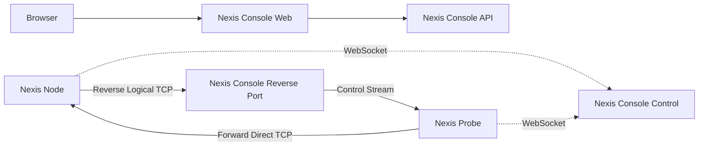

# Nexis Architecture

Nexis has three named components:

- Nexis Console: central control plane, REST API, Web UI, scheduler, and reverse logical tunnel manager.
- Nexis Node: remote public node under test.
- Nexis Probe: local network probe that initiates outbound control and TCP test connections.

## MVP Flow

## Direction Semantics

- Forward direct TCP: `Nexis Probe -> Nexis Node`
- Reverse logical TCP: `Nexis Node -> Nexis Console -> Nexis Probe`

The reverse path is intentionally labeled logical because it uses the Probe's existing outbound control connection rather than assuming public inbound reachability to the Probe.

## Storage

Nexis Console persists runtime data in PostgreSQL when `database.dsn` or `NEXIS_DATABASE_DSN` is configured. The local `./start-console.sh` script starts PostgreSQL with Docker Compose when available, otherwise it can use Homebrew PostgreSQL binaries, and uses `deploy/migrations/001_init.sql` compatible tables for agents, sessions, resource snapshots, TCP results, and reverse tunnel ports.
